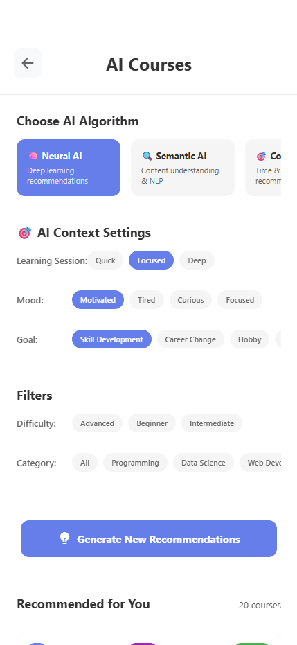
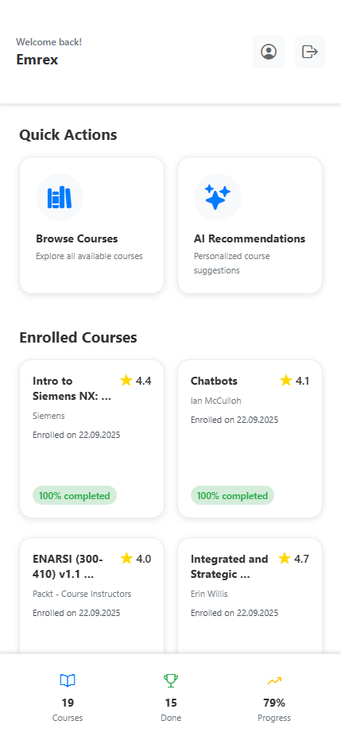
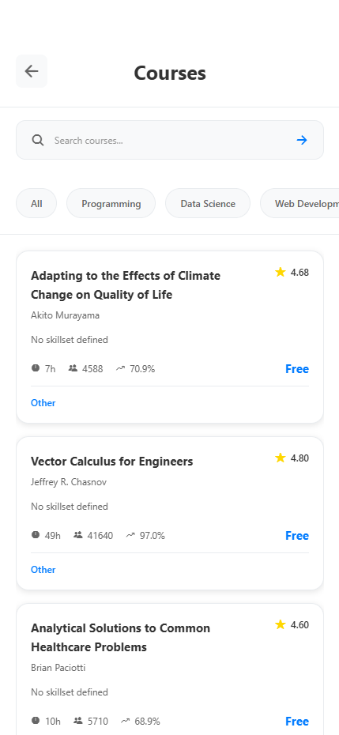
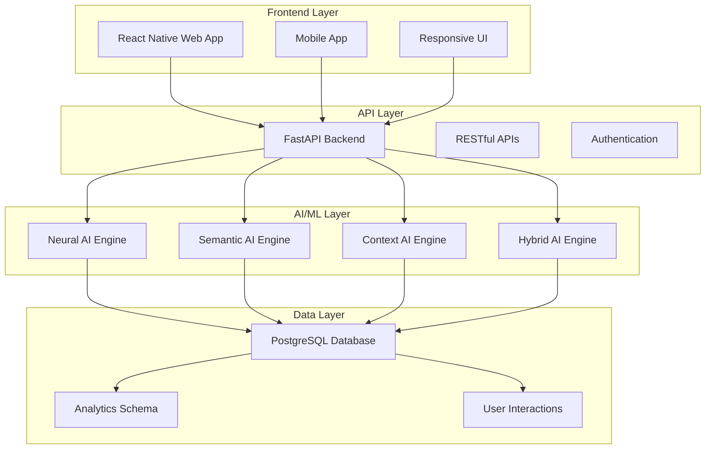

# 🧠 Smart Course Recommendation System

<div align="center">



**An advanced AI-powered course recommendation system with 7 cutting-edge algorithms**

[](https://python.org)
[](https://fastapi.tiangolo.com)
[](https://reactnative.dev)
[](https://postgresql.org)
[](LICENSE)

</div>

## 🚀 Overview

The Smart Course Recommendation System is a state-of-the-art AI platform that provides highly personalized course recommendations using **7 advanced machine learning algorithms**. From deep learning neural networks to semantic understanding with NLP, our system adapts to user preferences, learning context, and behavioral patterns.

## ✨ Key Features

### 🧠 **Advanced AI Algorithms**
- **🧠 Neural AI**: Deep learning with PyTorch neural networks
- **🔍 Semantic AI**: NLP-powered content understanding with spaCy & Sentence Transformers  
- **🎯 Context AI**: Time, mood, and device-aware recommendations
- **⚡ Hybrid AI**: Best overall recommendations combining multiple approaches
- **👥 Collaborative**: User similarity-based recommendations
- **📚 Content-Based**: Course content similarity matching
- **🔥 Popularity**: Trending courses fallback

### 🎯 **Context-Aware Intelligence**
- **Learning Session Types**: Quick (15-30 min), Focused (1-2 hours), Deep (3+ hours)
- **User Mood Detection**: Motivated, Tired, Curious, Focused
- **Learning Goals**: Skill Development, Career Change, Hobby, Certification
- **Device Optimization**: Mobile, Desktop, Tablet-specific recommendations

### 🔧 **Advanced Features**
- **Real-Time Learning**: Continuous model improvement from user feedback
- **Semantic Understanding**: Advanced NLP for content analysis
- **Extended Timeout**: 5-minute processing for complex AI operations
- **Graceful Fallback**: Reliable recommendations even when AI fails
- **Performance Optimized**: Efficient algorithms with intelligent caching

## 📱 Screenshots

<div align="center">

### 🏠 Home Screen


### 🧠 AI Recommendations


### 📚 Course Catalog


### 📖 Course Details


### 👤 User Profile


### 🔐 Authentication
 

</div>

## 🏗️ Architecture



### 🛠️ **Technology Stack**
- **Frontend**: React Native (mobile-first web application)
- **Backend**: Python FastAPI with async support
- **Database**: PostgreSQL with advanced analytics schema
- **AI/ML**: PyTorch, spaCy, Sentence Transformers, scikit-learn
- **Package Management**: `uv` for Python, `npm` for Node.js
- **Containerization**: Docker for consistent development environment

## 📋 Prerequisites

- **Python**: 3.10+ (recommended: 3.12)
- **Node.js**: 18+ (for React Native frontend)
- **PostgreSQL**: 13+ (database)
- **Docker**: 20+ (optional, for containerized setup)
- **Package Managers**: `uv` (Python), `npm` (Node.js)

## 🚀 Quick Start

### 1. Clone and Setup
```bash
git clone https://github.com/your-username/smart-course-recommendation-system.git
cd smart-course-recommendation-system

# Copy environment template
cp env.example .env
# Edit .env with your database credentials
```

### 2. Database Setup
```bash
# Option A: Local PostgreSQL
sudo -u postgres psql
CREATE DATABASE course_recommendation;
CREATE USER your_username WITH PASSWORD 'your_password';
GRANT ALL PRIVILEGES ON DATABASE course_recommendation TO your_username;

# Option B: Docker PostgreSQL
docker run --name postgres-db \
  -e POSTGRES_DB=course_recommendation \
  -e POSTGRES_USER=your_username \
  -e POSTGRES_PASSWORD=your_password \
  -p 5432:5432 -d postgres:13
```

### 3. Install Dependencies
```bash
# Python dependencies with uv
uv sync

# AI/ML dependencies
cd ai-ml && uv sync
uv run python -m spacy download en_core_web_sm

# Frontend dependencies
cd ../frontend && npm install
```

### 4. Initialize System
```bash
# Database migrations
cd backend
uv run alembic upgrade head

# Train AI models (first time only)
cd ../ai-ml
uv run python training/train_models.py

# Seed sample data
cd ../backend
uv run python scripts/seed_data.py
```

### 5. Start Services
```bash
# Backend (Terminal 1)
cd backend
uv run python -m uvicorn app.main:app --reload --host 0.0.0.0 --port 8000

# Frontend (Terminal 2)
cd frontend
npm run web
```

### 6. Access the Application
- **Frontend**: http://localhost:3000
- **Backend API**: http://localhost:8000
- **API Documentation**: http://localhost:8000/docs

## 📁 Project Structure

```
smart-course-recommendation-system/
├── 🧠 ai-ml/                     # AI/ML Components
│   ├── inference/                # Recommendation engines
│   │   ├── recommendation_engine.py    # Main AI engine
│   │   ├── neural_collaborative_filtering.py
│   │   ├── semantic_understanding.py
│   │   ├── context_aware_engine.py
│   │   └── real_time_learning.py
│   ├── training/                 # Model training
│   │   ├── train_models.py
│   │   └── neural_collaborative_filtering.py
│   ├── models/                   # Trained models
│   └── requirements.txt          # AI dependencies
├── 🚀 backend/                   # FastAPI Backend
│   ├── app/
│   │   ├── api/api_v1/endpoints/ # API endpoints
│   │   ├── core/                 # Configuration
│   │   ├── models/               # Database models
│   │   ├── schemas/              # Pydantic schemas
│   │   ├── services/             # Business logic
│   │   └── utils/                # Utilities
│   ├── alembic/                  # Database migrations
│   └── pyproject.toml            # Python dependencies
├── 📱 frontend/                  # React Native Frontend
│   ├── src/
│   │   ├── components/           # Reusable components
│   │   ├── screens/              # Screen components
│   │   │   ├── RecommendationsScreen.tsx
│   │   │   ├── CoursesScreen.tsx
│   │   │   └── ...
│   │   ├── navigation/           # Navigation setup
│   │   ├── services/             # API services
│   │   ├── store/                # Redux state management
│   │   ├── styles/               # Responsive styling
│   │   └── types/                # TypeScript types
│   └── package.json              # Node dependencies
├── 🗄️ database/                  # Database Scripts
│   ├── init/                     # Initialization scripts
│   ├── migrations/               # Schema migrations
│   └── seeds/                    # Sample data
├── 📚 docs/                      # Documentation
│   ├── screenshots/              # Application screenshots
│   ├── recommendation_systems.md # Algorithm documentation
│   └── api/                      # API documentation
├── 🐳 docker-compose.yml         # Container orchestration
├── 📋 how_to_run.md              # Detailed setup guide
├── 🔧 env.example                # Environment template
└── 📖 README.md                  # This file
```

## 🤖 AI Algorithms Deep Dive

### 🧠 Neural AI (Neural Collaborative Filtering)
- **Technology**: PyTorch neural networks with embedding layers
- **Architecture**: User/Item embeddings → Hidden layers → Preference prediction
- **Best For**: Users with 20+ interactions, maximum personalization
- **Processing Time**: 30-60 seconds
- **Confidence**: 0.7-0.95

### 🔍 Semantic AI (Advanced NLP)
- **Technology**: spaCy + Sentence Transformers for semantic understanding
- **Features**: Course content analysis, skill ontology, learning paths
- **Best For**: Goal-based learning, skill development
- **Processing Time**: 20-40 seconds
- **Confidence**: 0.6-0.9

### 🎯 Context AI (Context-Aware)
- **Technology**: Multi-factor context analysis
- **Features**: Time, mood, device, session optimization
- **Best For**: Situational learning, time-constrained users
- **Processing Time**: 10-20 seconds
- **Confidence**: 0.5-0.8

### ⚡ Hybrid AI (Best Overall)
- **Technology**: Multi-algorithm fusion with intelligent weighting
- **Features**: Combines all approaches for optimal results
- **Best For**: Production environments, maximum quality
- **Processing Time**: 45-90 seconds
- **Confidence**: 0.7-0.95

## 🔧 Development

### Backend Development
```bash
cd backend

# Install development dependencies
uv sync --dev

# Run tests
uv run pytest

# Format code
uv run black .
uv run isort .

# Lint code
uv run flake8 .
```

### Frontend Development
```bash
cd frontend

# Install dependencies
npm install

# Run tests
npm test

# Lint code
npm run lint

# Type checking
npm run type-check
```

### AI/ML Development
```bash
cd ai-ml

# Install AI dependencies
uv sync

# Train models
uv run python training/train_models.py

# Test AI engine
uv run python -c "
from inference.recommendation_engine import AIRecommendationEngine
print('AI Engine ready!')
"
```

## 🗄️ Database Schema

### Core Tables
- **users**: User profiles and preferences
- **courses**: Course catalog with rich metadata
- **categories**: Course categorization
- **user_interactions**: Behavioral tracking
- **enrollments**: Course enrollment history
- **recommendations**: Generated recommendations
- **recommendation_logs**: Analytics and performance tracking

### Analytics Schema
- **user_learning_profile**: AI-optimized user profiles
- **course_analytics**: Course performance metrics
- **interaction_analytics**: User behavior analysis

## 📊 API Documentation

### Core Endpoints
- **GET** `/api/v1/recommendations/` - Get personalized recommendations
- **POST** `/api/v1/recommendations/` - Generate recommendations with filters
- **GET** `/api/v1/courses/` - Browse course catalog
- **GET** `/api/v1/users/me` - User profile management
- **POST** `/api/v1/auth/login` - User authentication

### AI-Specific Endpoints
- **GET** `/api/v1/recommendations/data-requirements` - Check AI data requirements
- **POST** `/api/v1/recommendations/feedback` - Submit recommendation feedback
- **GET** `/api/v1/training/status` - AI model training status

**Interactive Documentation**: http://localhost:8000/docs

## 🧪 Testing

```bash
# Backend tests
cd backend
uv run pytest

# Frontend tests
cd frontend
npm test

# AI system tests
cd ai-ml
uv run python -c "
from inference.recommendation_engine import AIRecommendationEngine
from app.core.database import get_db
engine = AIRecommendationEngine(next(get_db()))
print('✅ AI Engine test passed!')
"

# Integration tests
docker-compose -f docker-compose.test.yml up --abort-on-container-exit
```

## 🚀 Deployment

### Production Environment
```bash
# Set production environment
export ENVIRONMENT=production
export DEBUG=false
export LOG_LEVEL=INFO

# Build production images
docker-compose -f docker-compose.prod.yml build

# Deploy to production
docker-compose -f docker-compose.prod.yml up -d
```

### Environment Variables
```env
# Database
POSTGRES_SERVER=your-db-host
POSTGRES_USER=your-username
POSTGRES_PASSWORD=your-password
POSTGRES_DB=course_recommendation
POSTGRES_PORT=5432

# Security
SECRET_KEY=your-secret-key-here
ALGORITHM=HS256
ACCESS_TOKEN_EXPIRE_MINUTES=30

# AI/ML
AI_MODELS_PATH=./ai-ml/models
AI_TRAINING_DATA_PATH=./ai-ml/data

# API
API_V1_STR=/api/v1
PROJECT_NAME=Smart Course Recommendation System
VERSION=1.0.0
```

## 📈 Performance & Monitoring

### AI Performance Metrics
- **Neural AI**: 30-60s processing, 0.7-0.95 confidence
- **Semantic AI**: 20-40s processing, 0.6-0.9 confidence
- **Context AI**: 10-20s processing, 0.5-0.8 confidence
- **Hybrid AI**: 45-90s processing, 0.7-0.95 confidence

### Monitoring Tools
```bash
# Check AI model performance
cd ai-ml
uv run python -c "
import json
with open('models/training_summary.json', 'r') as f:
    print('Model Performance:', json.load(f))
"

# Monitor API performance
curl -w "@curl-format.txt" -o /dev/null -s "http://localhost:8000/api/v1/recommendations/"
```

## 🤝 Contributing

We welcome contributions! Please see our [Contributing Guide](CONTRIBUTING.md) for details.

### Development Workflow
1. Fork the repository
2. Create a feature branch (`git checkout -b feature/amazing-ai-algorithm`)
3. Make your changes
4. Add tests for new functionality
5. Ensure all tests pass (`npm test && uv run pytest`)
6. Commit your changes (`git commit -m 'Add amazing AI algorithm'`)
7. Push to the branch (`git push origin feature/amazing-ai-algorithm`)
8. Open a Pull Request

### AI Algorithm Contributions
- Follow the existing algorithm structure in `ai-ml/inference/`
- Add comprehensive tests in `ai-ml/tests/`
- Update documentation in `docs/recommendation_systems.md`
- Ensure performance benchmarks are met

## 📝 License

This project is licensed under the MIT License - see the [LICENSE](LICENSE) file for details.

## 🆘 Support & Documentation

### 📚 Documentation
- **[How to Run Guide](how_to_run.md)** - Detailed setup and configuration
- **[AI Algorithms Guide](docs/recommendation_systems.md)** - Comprehensive algorithm documentation
- **[API Documentation](http://localhost:8000/docs)** - Interactive API reference
- **[Database Schema](docs/database/)** - Database structure and relationships

### 🆘 Getting Help
1. **Check Documentation**: Start with [how_to_run.md](how_to_run.md)
2. **Search Issues**: Look through existing [GitHub Issues](https://github.com/your-repo/issues)
3. **Create Issue**: Provide detailed information about your problem
4. **Join Community**: [Discord](https://discord.gg/your-invite) for real-time help

### 🐛 Troubleshooting
- **Database Issues**: Check [Database Setup](how_to_run.md#database-setup)
- **AI Model Issues**: See [AI Troubleshooting](how_to_run.md#ai-model-issues)
- **Frontend Issues**: Check [Frontend Setup](how_to_run.md#frontend-issues)
- **Performance Issues**: Review [Performance Guide](how_to_run.md#performance-issues)

## 🗺️ Roadmap

### 🚀 Phase 1: Advanced ML (Next 3 months)
- [ ] **Deep Learning**: Enhanced neural networks with attention mechanisms
- [ ] **Multi-Modal AI**: Image and video content analysis
- [ ] **Federated Learning**: Privacy-preserving model training
- [ ] **A/B Testing**: Algorithm performance comparison framework

### 🎯 Phase 2: Advanced Features (Next 6 months)
- [ ] **Learning Paths**: Intelligent course sequencing
- [ ] **Prerequisite Analysis**: Course dependency mapping
- [ ] **Difficulty Progression**: Adaptive difficulty adjustment
- [ ] **Social Learning**: Peer learning and collaboration features

### 🌟 Phase 3: Enterprise Features (Next 12 months)
- [ ] **Multi-Tenant**: Organization-specific recommendations
- [ ] **Analytics Dashboard**: Recommendation performance metrics
- [ ] **API Integration**: Third-party learning platform integration
- [ ] **Custom Models**: Organization-specific model training

## 🎉 Acknowledgments

- **FastAPI** for the excellent async web framework
- **React Native** for cross-platform mobile development
- **PyTorch** for deep learning capabilities
- **spaCy** for advanced NLP processing
- **PostgreSQL** for robust data storage
- **uv** for fast Python package management

---

<div align="center">

**Built with ❤️ and AI**

[⭐ Star this repo](https://github.com/emrecanoner/smart-course-recommendation-system) | [🐛 Report Bug](https://github.com/emrecanoner/smart-course-recommendation-system/issues) | [💡 Request Feature](https://github.com/emrecanoner/smart-course-recommendation-system/issues)

</div>